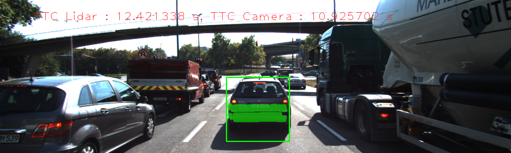
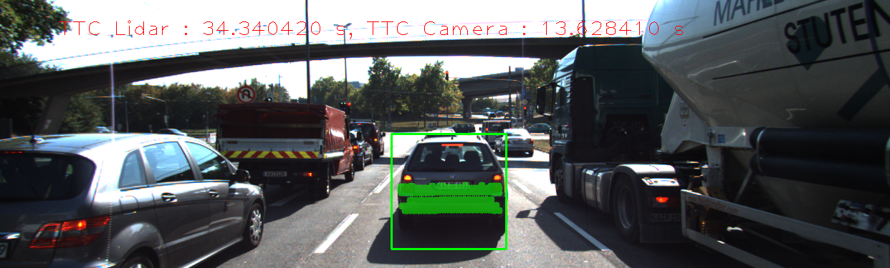
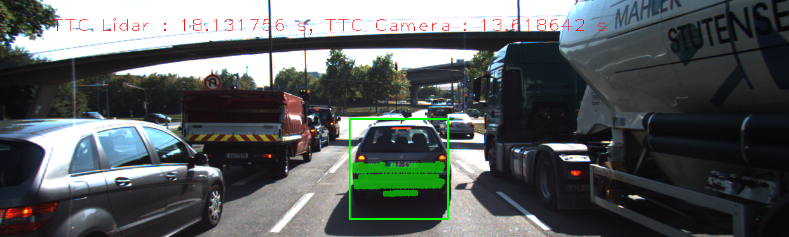
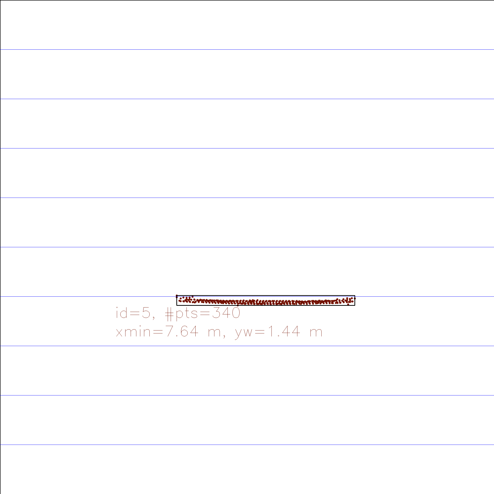
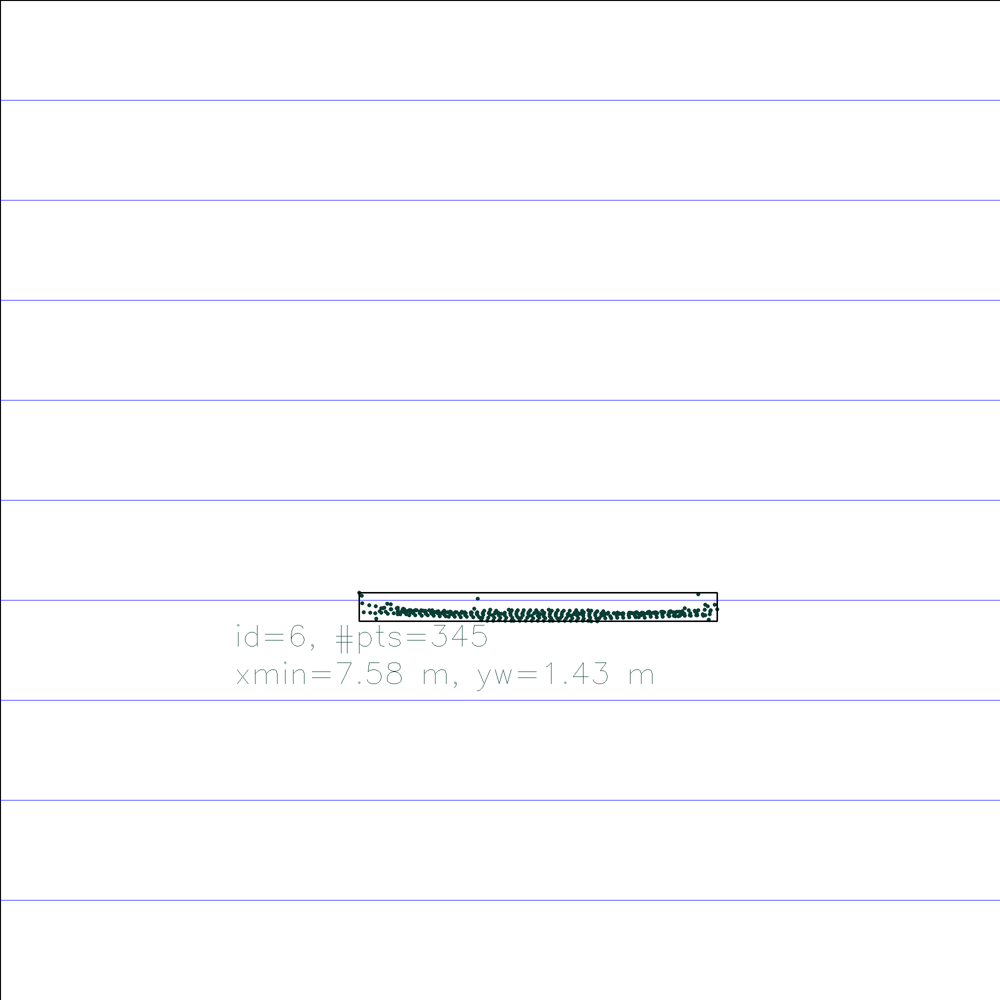
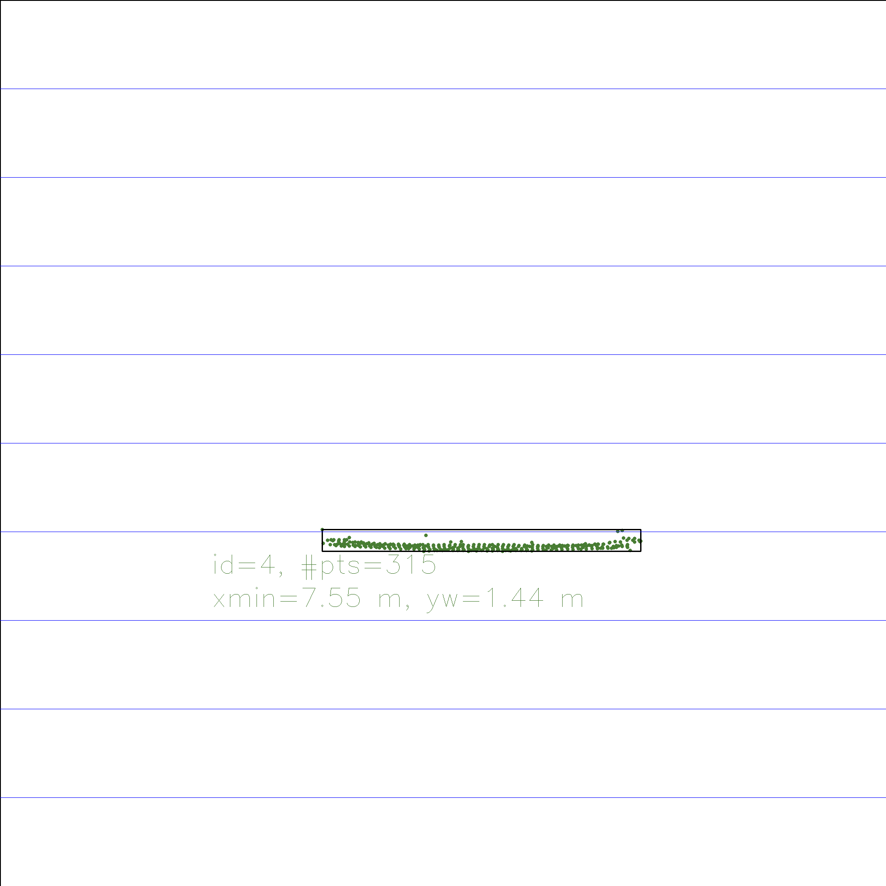
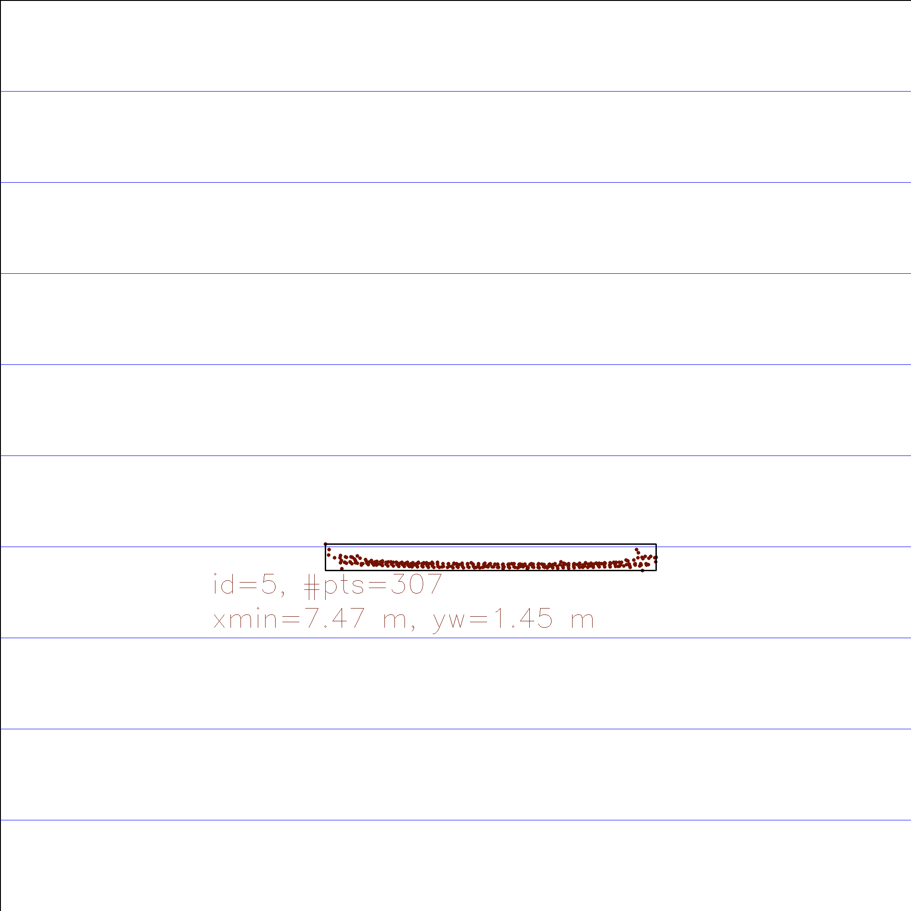
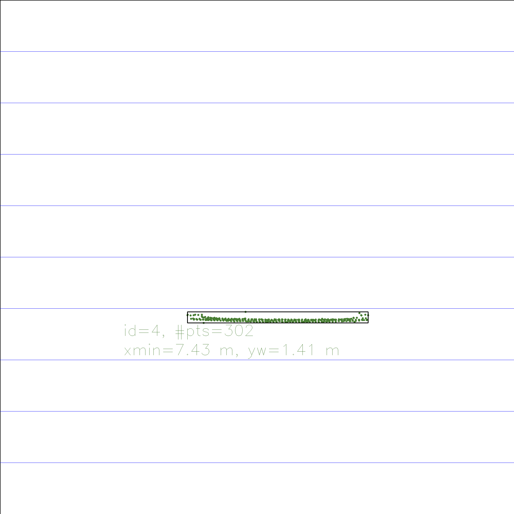

# Final Report

## FP.5 Performance Evaluation 1

The tables below show a sequence of images with TTC estimation and its corresponding Lidar points in BEV, where an implausible Lidar TTC estimation was observed. The TTC Lidar in this sequence shows a very strong fluctuation of TTC between 9.34s and 34.34s, whereas the sequence is only 0.4s long and no rapid acceleration is observed. This can be attributed to the constant velocity model, where only the distance difference between current and previous frame is considered. In the real world scenario with complex combination between acceleration and brake degree, the constant velocity model is not able to fit this motion and causes the instability of TTC.

### TTC images
| frame | TTC image |
| ----- |    :-:    |
| 1 |  |
| 2 |  |
| 3 |  |
| 4 |  |

### BEV images
| frame | BEV image |
| ----- |    :-:    |
| 0 |  |
| 1 |  |
| 2 |  |
| 3 |  |
| 4 |  |

## FP.6 Performance Evaluation 2

The camera TTC of all detector & descriptor combinations is shown in the table below as well as in the [csv](./FP_6/results.csv) file.

| Detector  | Descriptor | 1       | 2       | 3        | 4       | 5       | 6       | 7       | 8        | 9       | 10      | 11      | 12      | 13       | 14      | 15       | 16      | 17      | 18      |
| --------- | ---------- | ------- | ------- | -------- | ------- | ------- | ------- | ------- | -------- | ------- | ------- | ------- | ------- | -------- | ------- | -------- | ------- | ------- | ------- |
| SHITOMASI | BRISK      | 14.0745 | 12.9008 | 13.5082  | 12.135  | 12.5265 | 13.6276 | 12.8554 | 13.5027  | 11.7045 | 13.4059 | 11.2578 | 11.6823 | 11.7158  | 11.4946 | 9.36489  | 11.3079 | 11.2613 | 9.01942 |
| HARRIS    | BRISK      | 9.74953 | nan     | -80.8525 | 11.7693 | 89.8332 | 13.5599 | 12.2792 | 13.5704  | nan     | -inf    | -inf    | 11.8228 | 284.161  | 7.72144 | -13.6263 | 6.7641  | 12.5848 | -inf    |
| FAST      | BRISK      | 12.6032 | 12.4756 | 12.2128  | 12.632  | 13.6434 | 11.9483 | 12.7601 | 12.1502  | 12.3224 | 13.6011 | 11.957  | 11.9779 | 11.6331  | 11.3257 | 11.0006  | 11.0573 | 10.2259 | 11.7229 |
| BRISK     | BRISK      | 13.4086 | 21.5636 | 14.1928  | 15.2939 | 26.9409 | 18.2567 | 18.0444 | 16.6104  | 15.4705 | 13.3926 | 12.1405 | 11.5983 | 12.0478  | 12.0481 | 12.7106  | 11.3604 | 9.29555 | 11.5648 |
| ORB       | BRISK      | 15.0893 | 15.6278 | 12.3578  | 167.629 | -inf    | 10.8157 | -inf    | 21.0673  | 8.10594 | -inf    | 7.97816 | 9.47411 | -inf     | 13.2765 | 13.018   | 28.0396 |         |         |
| AKAZE     | BRISK      | 11.8806 | 15.4239 | 13.3178  | 14.3668 | 14.8916 | 14.7351 | 15.9391 | 13.895   | 14.1274 | 11.9235 | 12.41   | 10.3426 | 10.0883  | 10.0358 | 10.26    | 10.4298 | 9.64323 | 8.99207 |
| SIFT      | BRISK      | 11.5917 | 13.4516 | 13.7741  | 18.4643 | 15.1342 | 11.3755 | 14.3616 | 15.7626  | 13.7621 | 11.5111 | 12.7615 | 10.3023 | 9.56959  | 9.4754  | 9.4774   | 8.61414 | 9.45039 | 9.49313 |
|  |
| SHITOMASI | BRIEF      | 14.345  | 13.1626 | 11.7058  | 13.6506 | 12.1083 | 13.395  | 14.2532 | 12.3124  | 11.9031 | 13.8555 | 11.8507 | 11.6413 | 12.3223  | 11.7964 | 11.9082  | 11.9824 | 11.1869 | 8.14662 |
| HARRIS    | BRIEF      | 9.74953 | nan     | -80.8525 | 11.7693 | 13.6432 | 15.5268 | 15.8978 | 13.5704  | 3.30058 | 20.5862 | 11.7414 | 11.8228 | 284.161  | 5.6061  | -13.6263 | 6.92571 | 12.5848 | -inf    |
| FAST      | BRIEF      | 11.711  | 12.3389 | 14.1695  | 13.3946 | 14.9505 | 13.5021 | 13.3098 | 12.7931  | 12.729  | 13.8607 | 12.1679 | 11.4832 | 11.8565  | 10.9688 | 11.5865  | 10.4345 | 9.85306 | 11.6218 |
| BRISK     | BRIEF      | 13.8976 | 18.7068 | 12.3177  | 20.6364 | 19.9284 | 18.1616 | 16.2214 | 18.4255  | 15.774  | 12.9777 | 13.9816 | 14.355  | 12.5496  | 11.6747 | 11.0958  | 13.3034 | 11.2381 | 10.6641 |
| ORB       | BRIEF      | 23.9769 | 57.2087 | 102.1    | 14.1667 | 22.8072 | -48.152 | -inf    | 76.5598  | -inf    | 23.0082 | 17.0883 | 16.203  | 13.301   | 9.88105 | 8.94125  | 10.9531 | 13.2122 | 20.2865 |
| AKAZE     | BRIEF      | 13.2222 | 14.851  | 13.5986  | 13.8489 | 15.1918 | 13.895  | 15.8182 | 14.1314  | 13.8546 | 11.5994 | 12.5843 | 11.5223 | 10.1929  | 9.87627 | 9.95571  | 10.1205 | 9.60333 | 9.38526 |
| SIFT      | BRIEF      | 12.491  | 13.3984 | 15.3197  | 20.5143 | 13.6636 | 12.3738 | 15.8102 | 15.9776  | 13.9109 | 10.1713 | 12.1287 | 10.3419 | 10.0352  | 9.55257 | 10.1242  | 8.73744 | 8.8212  | 9.32687 |
|  |
| SHITOMASI | ORB        | 13.8003 | 12.425  | 11.7005  | 12.4414 | 12.0556 | 13.7561 | 11.9306 | 12.1365  | 11.2465 | 13.4962 | 11.3517 | 11.5464 | 12.3267  | 11.5476 | 10.6753  | 12.0427 | 10.4321 | 7.92253 |
| HARRIS    | ORB        | 9.74953 | nan     | -80.8525 | 11.7693 | 13.6432 | 14.1981 | 14.2744 | 13.5704  | nan     | -inf    | 11.7414 | 11.8228 | 284.161  | 5.66097 | -13.6263 | 6.92571 | 12.5848 | -inf    |
| FAST      | ORB        | 11.9107 | 12.2661 | 11.6077  | 13.1145 | 13.255  | 12.2738 | 13.7616 | 12.5797  | 12.3043 | 13.4522 | 11.8197 | 11.3897 | 11.7503  | 10.8332 | 10.1089  | 10.201  | 9.92849 | 11.2638 |
| BRISK     | ORB        | 14.9608 | 18.4018 | 14.195   | 16.6159 | 19.5054 | 19.7366 | 16.6034 | 18.6689  | 14.4584 | 12.4419 | 12.7305 | 11.5086 | 12.1046  | 12.3735 | 12.0918  | 11.5417 | 10.2981 | 11.73   |
| AKAZE     | ORB        | 12.4299 | 14.3781 | 13.101   | 14.2509 | 15.628  | 13.8404 | 15.7672 | 14.1731  | 13.6056 | 11.5897 | 12.4627 | 11.623  | 10.119   | 10.3948 | 10.6955  | 10.1741 | 9.1282  | 9.15995 |
| ORB       | ORB        | 19.4668 | 11.493  | 17.4995  | -inf    | -inf    | -inf    | -inf    | -inf     | 9.09836 | -inf    | 9.47693 | -inf    | -inf     | -inf    | 18.1052  | 32.95   |         |         |
|  |
| SHITOMASI | FREAK      | 13.8195 | 13.0764 | 11.3769  | 12.382  | 12.2908 | 14.4568 | 12.7924 | 12.7542  | 12.1442 | 13.0164 | 11.2395 | 11.848  | 12.3243  | 11.5404 | 10.3217  | 11.7575 | 11.3035 | 7.87897 |
| HARRIS    | FREAK      | 9.74953 | nan     | -18.2644 | 11.7693 | 35.3833 | 13.9039 | 12.3971 | 12.6385  | nan     | 20.5862 | -inf    | 12.245  | 13.4327  | 12.288  | -inf     | 6.87135 | nan     | nan     |
| FAST      | FREAK      | 12.2073 | 12.6074 | 13.2096  | 13.3802 | 12.5072 | 11.8956 | 12.7155 | 12.2884  | 12.5535 | 12.8599 | 12.0261 | 12.195  | 11.616   | 11.0636 | 10.5807  | 10.7912 | 10.1886 | 11.4262 |
| BRISK     | FREAK      | 12.6767 | 22.2235 | 14.2082  | 13.9445 | 23.4599 | 18.327  | 16.9683 | 18.3667  | 15.679  | 13.855  | 13.5736 | 11.4238 | 11.7447  | 12.2076 | 12.6158  | 10.3599 | 9.35262 | 11.679  |
| ORB       | FREAK      | 12.2074 | 20.3189 | 12.759   | 743.244 | -inf    | 8.93618 | -inf    | -545.044 | 7.23983 | 40.8841 | 6.3262  | 60.2671 | 8.68505  | 7.74178 | 32.1974  | 7.62862 |         |         |
| AKAZE     | FREAK      | 12.2538 | 14.0197 | 13.9327  | 13.9759 | 16.0153 | 14.4931 | 15.3629 | 13.7257  | 13.6586 | 11.9496 | 12.2176 | 10.7768 | 10.7569  | 9.98667 | 10.0011  | 10.463  | 9.11759 | 8.76567 |
| SIFT      | FREAK      | 11.2996 | 13.5927 | 13.5099  | 19.7153 | 14.3033 | 11.9097 | 14.8528 | 15.5756  | 14.4084 | 11.7012 | 12.1287 | 10.308  | 10.036   | 9.77233 | 9.1082   | 8.77206 | 9.02847 | 9.71242 |
|  |
| AKAZE     | AKAZE      | 12.2825 | 14.0742 | 12.9275  | 14.1963 | 16.5174 | 13.8675 | 15.2979 | 14.2057  | 14.0879 | 11.5662 | 12.1757 | 11.1822 | 10.7853  | 10.5482 | 10.4303  | 10.1134 | 9.12287 | 8.9504  |
|  |
| SHITOMASI | SIFT       | 14.7593 | 13.2402 | 11.4732  | 12.7521 | 12.1368 | 13.0851 | 13.312  | 12.1296  | 11.9769 | 13.5534 | 11.8645 | 11.6524 | 11.8779  | 11.5273 | 12.1949  | 11.5466 | 10.8127 | 9.42473 |
| HARRIS    | SIFT       | 9.74953 | 52.7952 | -80.8525 | 13.6432 | 14.2744 | 13.5704 | 3.30058 | 20.5862  | 11.7414 | 11.8228 | 284.161 | 5.66097 | -13.6263 | 6.92571 | 12.5848  | -inf    |         |         |
| FAST      | SIFT       | 12.3008 | 11.3452 | 14.3463  | 13.3476 | 14.1074 | 13.0809 | 13.1517 | 12.9297  | 12.5796 | 13.8364 | 12.0527 | 11.4515 | 11.9291  | 11.4696 | 11.355   | 10.7261 | 9.38443 | 10.6724 |
| BRISK     | SIFT       | 13.4102 | 16.8864 | 16.7905  | 13.3615 | 31.2867 | 17.368  | 13.4691 | 16.6053  | 16.342  | 14.5577 | 13.4591 | 11.1832 | 13.8559  | 11.0679 | 14.6134  | 11.1969 | 10.9486 | 11.7994 |
| ORB       | SIFT       | 15.0609 | 13.2126 | 12.3999  | 156.224 | -inf    | 9.11704 | -inf    | -inf     | 8.40419 | -inf    | 8.0136  | 14.5133 | 51.405   | 9.11581 | 18.5084  | 17.0851 |         |         |
| AKAZE     | SIFT       | 12.4436 | 14.5297 | 13.1854  | 14.0327 | 16.6901 | 13.9912 | 15.4665 | 13.8353  | 14.0823 | 11.788  | 12.3256 | 11.1905 | 10.7927  | 10.5186 | 10.2402  | 10.1134 | 9.03041 | 9.08906 |
| SIFT      | SIFT       | 11.6242 | 12.5711 | 13.2068  | 18.4941 | 12.591  | 10.9257 | 13.6284 | 15.1408  | 13.6186 | 10.8758 | 11.3368 | 11.0695 | 9.45618  | 10.3737 | 9.78878  | 9.08409 | 8.63926 | 8.83266 |

