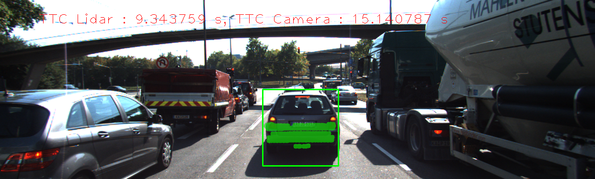
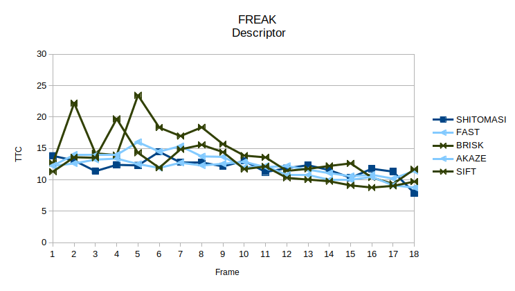

# Final Report

## FP.5 Performance Evaluation 1

The tables below show a sequence of images with TTC estimation and its corresponding Lidar points in BEV, where an implausible Lidar TTC estimation was observed. The TTC Lidar in this sequence shows a very strong fluctuation of TTC between 9.34s and 34.34s, whereas the sequence is only 0.4s long and no rapid acceleration is observed. This can be attributed to the constant velocity model, where only the distance difference between current and previous frame is considered. In the real world scenario with complex combination between acceleration and brake degree, the constant velocity model is not able to fit this motion and causes the instability of TTC.

### TTC images
| frame | TTC image |
| ----- |    :-:    |
| 1 |  |
| 2 |  |
| 3 |  |
| 4 |  |

### BEV images
| frame | BEV image |
| ----- |    :-:    |
| 0 |  |
| 1 |  |
| 2 |  |
| 3 |  |
| 4 |  |

## FP.6 Performance Evaluation 2

The camera TTC of all detector & descriptor combinations can be found in the [csv](./FP_6/results.csv) file. After that, the line charts below show the TTC of different keypoint detectors over time for every keypoint descriptor respectively. As Harris and ORB detector always produce unreliable results, e.g. -inf, Nan, unsuccess matchings (fewer frames recorded in the table), we omit them in all graphs.

It seems that BRISK detector is sometimes way off due to the fluctuations in TTC estimation, which again can be attributed to the constant velocity model discussed before. However, using an average or a median of distances between every matched keypoint pairs could increase the stability compared to using the single nearest point in Lidar TTC. This can be proofed with some other detector & descriptor combinations in camera TTC, where a smoother line can be observed. For example, the FAST and AKAZE detector produced smoothest line with almost all descriptors. The best combinations might be FAST+SIFT, AKAZE+AKAZE and AKAZE+SIFT. However, this should further be validated using some accuracy metrics.

